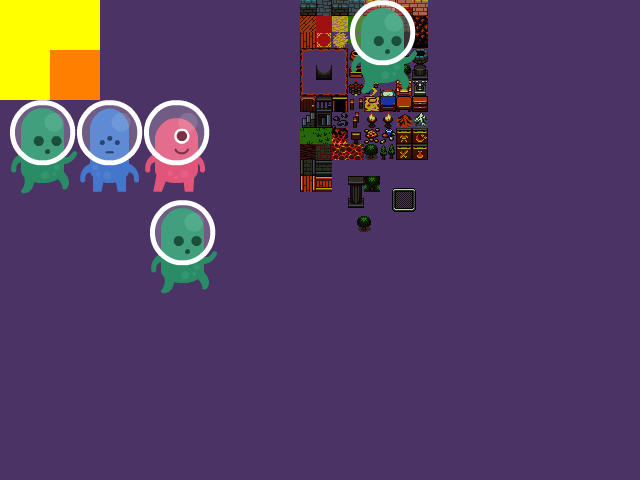

# Tīefring

## A 2d engine

Sure, let's write some kind of 2d engine.

What I'm aiming for:

* A simple API, with primitives:
  + draw sprites
  + draw rectangles, polygons, 
  + draw text, 

What I'm not aiming for:

* A full 2d game engine solution, with game loop, event handling, and so on.

This project is pretty much for learning, and because I think there is room for something really really simple to draw basic stuff.

Ortho camera: https://www.reddit.com/r/opengl/comments/fmmtcs/pixel_perfect_window_size/

## Examples

* [Sample](sample) - Random call to the api to validate it works.
* [Snake](snake) - A snake implementation.

## Resources

* https://opengameart.org/content/platformer-art-deluxe
* https://opengameart.org/content/tiny-16-basic
* https://freesvg.org/blue-rocket-taking-off-vector-drawing
